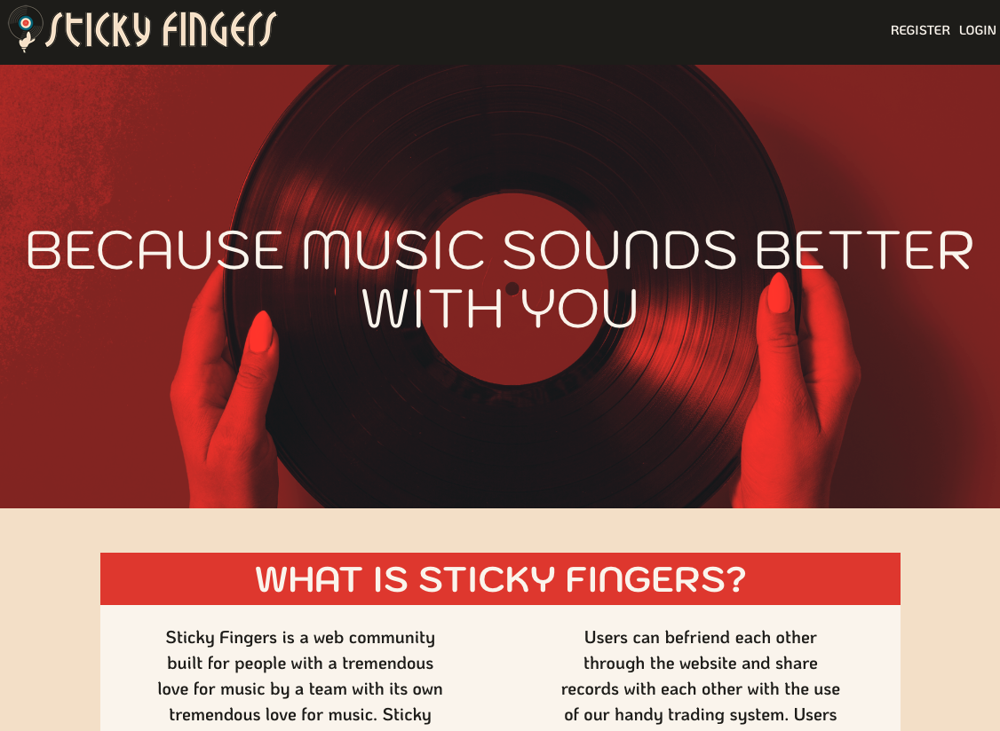
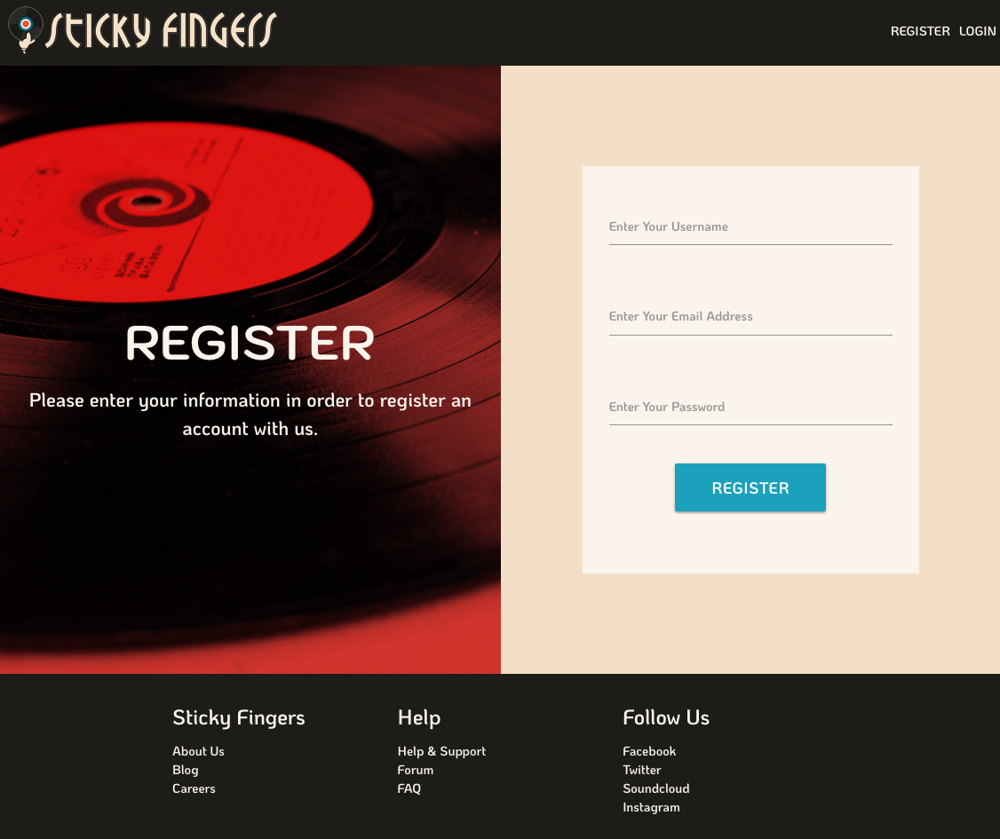
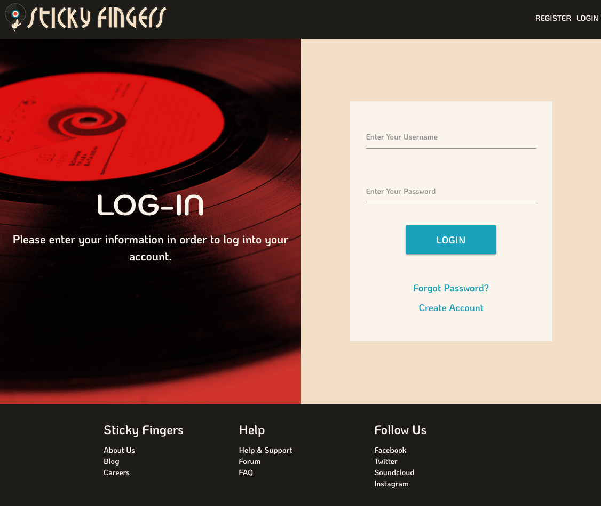

# Sticky Fingers
<!--  -->

## Contents
    * Description
    * Features
    * Technologies
    * Challenges and Solutions
    * MVP
    * Stretch Goals
    * Authors
    * Screenshots

## Description
To be written later...

### Features
To be written later...

## Technologies
* HTML/CSS/JavaScript
* Node/Express
* React/Redux
* MySQL
* Discogs API

## Challenges and Solutions
To be written later...

## MVP
To be written later...

## Stretch Goals
* Embed Spotify player for individual record pages
    * Status: Incomplete

## Authors
* J.R. Priestman
    * Contributions:
        * React Routing, Express Routing, SQL Schema
    * [GitHub Profile](https://github.com/JRPriestman)
* Michael Rubino
    * Contributions:
        * Concept, Wireframing, Front-End Design, Discogs API Implementation
    * [GitHub Profile](https://github.com/rubinoAM)

## Screenshots
To be written later...
<!--* Landing Page

* Register Page

* Profile Setup Page

* Login Page

* Daily Input Form

* Weekly Progress Page

-->