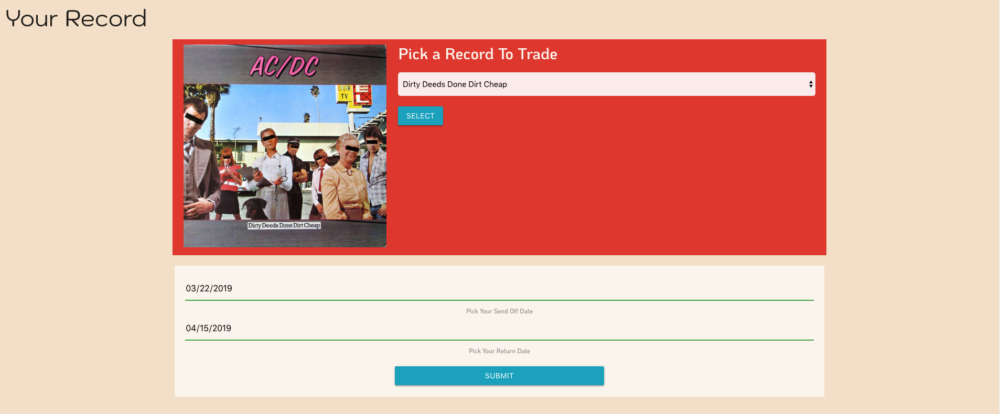

# Sticky Fingers


## Contents
    * Description
    * Features
    * Technologies
    * Challenges and Solutions
    * MVP
    * Stretch Goals
    * Authors
    * Screenshots

## Description
Sticky Fingers is a record collection application where users can show off what records they have in their collection and trade records with other users as well.

### Features
* Users are able to register an account with a fully customizable profile, including user avatars that the user can upload themselves to their account.
* Users can look for records to add to their collection using the Add Record page, which has a search form that links to the Discogs API in order to look for the necessary record information.
* Users can look through the community to find new people to befriend and look through each other's collections.
* Users are able to trade records with people on their friends list and are provided each other's mailing address to send the record to.

## Technologies
* HTML/CSS/JavaScript
* Node/Express
* React
* Redux
* MySQL
* Discogs API

## Challenges and Solutions
* Footer Issue
    * Certain pages within the Sticky Fingers app are dependent on mapping through arrays of data to provide the content populating them. In the instance of those arrays being on the smaller side, the footer would not stay attached to the bottom of the page. To fix this, we used a resize event listener to detect the quantity of entries in the array and adjust the footer's CSS styling based on specific breakpoints. Once the page is left, componentWillUnmount resets the affected CSS styling to its initial state.
    ```javascript
    componentDidMount(){
        this.setState({
            footer:window.document.getElementById('footer'),
        })
    }

    componentWillUnmount(){
        let footer = this.state.footer;
        footer.style.width = "auto";
        footer.style.position = "static";
        footer.style.bottom = "initial";
    }

    render(){
        // -------------------
        if (this.state.footer) {
            let footer = this.state.footer;
            window.addEventListener("resize",()=>{
                if(this.props.coll.length < 5 && this.props.coll.length > 2){
                    if(window.innerHeight >= 978 && window.innerWidth <= 1200 && window.innerWidth >= 993){
                        footer.style.width = "100vw";
                        footer.style.position = "absolute";
                        footer.style.top = "100vh";
                    } else {
                        footer.style.width = "auto";
                        footer.style.position = "static";
                        footer.style.top = "initial";
                    }
                } if (this.props.coll.length < 3){
                    if(window.innerHeight >= 978 && window.innerWidth <= 1645 && window.innerWidth >= 993){
                        footer.style.width = "100vw";
                        footer.style.position = "absolute";
                        footer.style.top = "100vh";
                    } else if(window.innerHeight >= 978 && window.innerWidth <= 992 && window.innerWidth >= 601){
                        footer.style.width = "100vw";
                        footer.style.position = "absolute";
                        footer.style.top = "100vh";
                    } else {
                        footer.style.width = "auto";
                        footer.style.position = "static";
                        footer.style.bottom = "initial";
                    }
                }
            })
        }
    }
    ```
* Updating Already Established Pieces of States
    * The friends and community piece of redux state are established upon user register/login and then need to be updated again once a new friend is added from the Community page. Since we now want our friends page to include our newly added friend, we need to call the friendsAction after the friend is added in order to udpate state and get the new friend to render on the friends page.
    ```javascript
    addFriend = (e)=>{
        e.preventDefault();
        const newFriend = this.state;
        const auth = this.props.auth;
        axios({
            method: 'POST',
            url: `${window.apiHost}/users/addfriend`,
            data: {
                newFriend,
                auth
            }
        }).then(()=>{
            this.props.friendsAction(this.props.auth);
            this.props.communityAction(this.props.auth);
        })
    }  
    ```
* Getting Information Involving More Than One Instance From Database
    * Due to the fact that a lot of the pages require information from several tables at once, a number of MySQL queries using inner joins became necessary. The main challenge to working with so many tables was figuring out how to collect information from the same table for two different instances (e.g. users, records, etc.). To overcome this challenge, we created two INNER JOIN's for any one table we needed to query twice by assigning the table a specific alias to signify which instance we were querying for.
    ```sql
    SELECT u2.userName, r1.name, r2.name
        FROM trades
        INNER JOIN records r1 ON trades.r1id = r1.id
        INNER JOIN records r2 ON trades.r2id = r2.id
        INNER JOIN users u1 ON trades.u1id = u1.id
        INNER JOIN users u2 ON trades.u2id = u2.id
        WHERE u1.id = 1;
    ```
* Managing State With Redux
    * Using the auth piece of Redux state, which contains data that identifies the current user to let Express know which user is currently logged in within other backend requests, proved to be a challenge in its own right. To handle the management of state using Redux, we utilized the componentWillReceiveProps method to determine if the auth has been properly updated.

    ```javascript
    //REACT
    componentWillReceiveProps(newProps){
        console.log(newProps);
        if(newProps.auth.msg === "User Exists"){
            this.setState({
                showAlert: true
            })
        }else if(newProps.auth.msg === 'User Added'){
            this.props.communityAction(newProps.auth);
            this.props.collectionAction(newProps.auth);
            this.props.friendsAction(newProps.auth);
            this.props.history.push('/users/profile');
        }
    }
    
    //REDUX
    const axiosPromise = axios({
        url: `${window.apiHost}/users/collection`,
        method: 'POST',
        data: {
            auth
        }
    })
    ```

    * The data within auth is now available in the Express route to be pulled out and referenced in our SQL query.:
    ```javascript
    const currentUserName = req.body.auth.userName;
    ```
* Promises with Discogs API
    * While it could be challenging to work with at first, the Discogs API ended up being very robust in terms of what information we were able to collect using it. The biggest hurdle with the API, though, was the issue with the API not being able to perform synchronously with its own promise methods. Thus we created a JavaScript Promise object that ran the initial search query to the Discogs API and chained a then method onto said Promise to return the query results to React.
    ```javascript
    const discogsPromise = new Promise((resolve, reject)=>{
        db.search(searchQuery,(err,data)=>{
            if(err){throw err}
            let results = data.results[0];
            resolve(results.master_id);
        })
    })

    discogsPromise.then((promiseData)=>{
        db.getMaster(promiseData,(err,data)=>{
        console.log("data response from discogs")
        console.log(data);
        let result
        if(data.message == 'The requested resource was not found.'){
            result = {
                msg: "No results"
            }
        }else{
            const title = data.title;
            const artist = data.artists[0].name;
            let genre = '';
            if(!data.styles){
                genre = data.genres[0];
            } else {
                genre = data.styles[0];
            }
            const year = data.year;
            const imageUrl = data.images[0].uri;
    
            result = {
                title,
                artist,
                genre,
                year,
                imageUrl,
            }
        }
        res.json(result);
        })
    })
    ```
*

## MVP
* Users must be able to create an account and a collection associated with their account
* Users must be able to add records to their collection using the Add Record page
* Users must be able to befriend other users on the website
* Users must be able to trade records with those listed as their friends

## Stretch Goals
* Embed Spotify player for individual record pages
    * Status: Incomplete
* Include Credit Card information for pending charges/retainer fee
    * Status: Incomplete
* Google/Spotify OAuth
    * Status: Incomplete
* Trending Statistics (Using Chart.js)
    * Status: Incomplete

## Authors
* J.R. Priestman
    * Contributions:
        * SCRUM Manager, React Component Setup & Routing, Front-End Design, Express Route Connection, SQL Schema and Database Setup, Redux and Axios Implementation
    * [GitHub Profile](https://github.com/JRPriestman)
* Michael Rubino
    * Contributions:
        * Concept, Wireframing, Front-End Design, Discogs API Implementation, Database Maintenance, Assistance with Redux, React Component Setup & Routing, Express Route Connection
    * [GitHub Profile](https://github.com/rubinoAM)

## Screenshots
* Landing Page


* Login Page


* Register Page


* Profile Page


* User Dashboard


* Add Record Page


* Collection Page


* Friends Page


* Other User's Profile


* Make Trade Page (Choosing A Recipient)


* Make Trade Page (Choosing Your Record)



* Community Page

